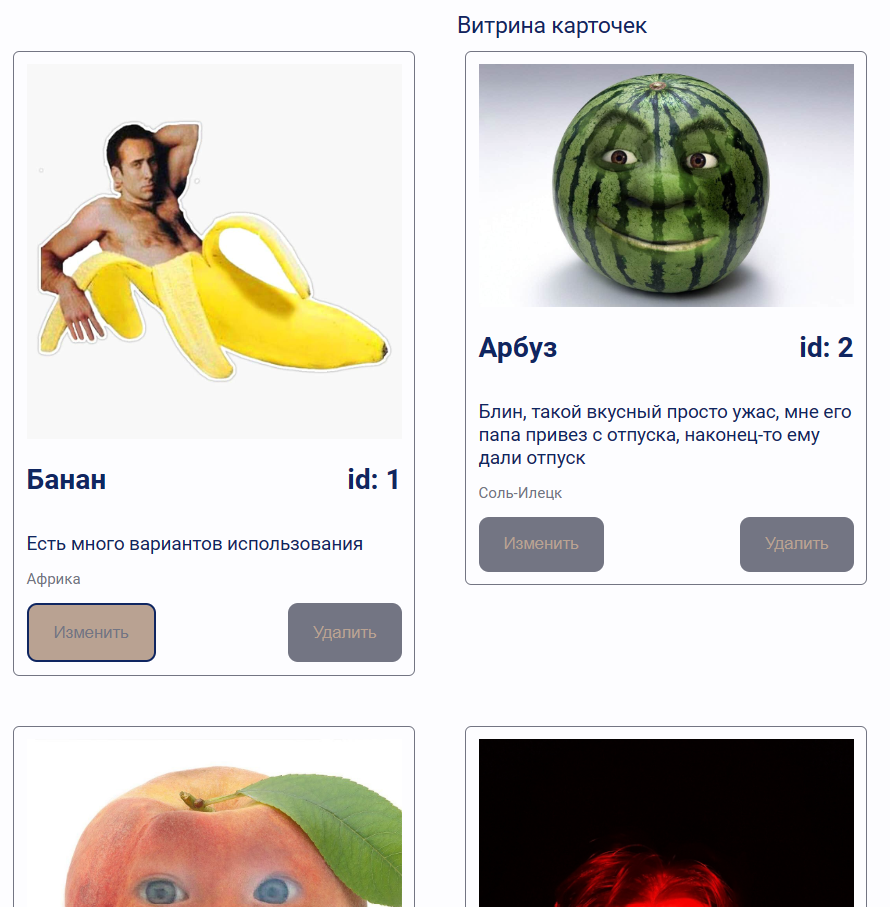

# Админка карточек(товаров)
## Кратко о проекте
Реализованы: добавление, изменение и удаление карточек, валидация при заполнении формы, сама форма, сами карточки, добавление стандартного пула карточек для проверки.

Внешний вид страницы:

Карточки можно добавлять при помощи формы, расположенной слева на странице, все поля являются необходимыми для заполнения, имеется проверка на ввод:

Но для удобства есть и встроенные карточки, которые можно подгрузить при помощи следующей кнопки:

После добавления или подгрузки карточки она появится справа на странице, при масштабе страницы 100% будут помещаться 2 карточки в строку:

Если на карточке нажать на кнопку "Изменить", то в форме кнопка "Добавить" изменится на кнопку "Изменить":

Имеются проверки на ввод: код товара должен быть неотрицательным числом, в ссылке должна быть правда ссылка, все поля должны быть заполнены. Вот пример одного из алертов (заполнены не все поля):

## Запуск
Предварительно должны быть установлены git и nodejs(версия lts 16 и выше)
- install node.js v16>(npm v7.x>) (https://nodejs.org/en/download/)
- install git(https://git-scm.com/downloads)