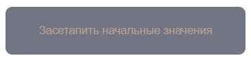

# Админка карточек(товаров)
## Кратко о проекте
Реализованы: добавление, изменение и удаление карточек, валидация при заполнении формы, сама форма, сами карточки, добавление стандартного пула карточек для проверки, loader и скелетон, кнопка удаления всех карточек (просто для удобства), подгрузка имени, фамилии и группы с сервера.

Внешний вид страницы:

Карточки можно добавлять при помощи формы, расположенной слева на странице, все поля являются необходимыми для заполнения, имеется проверка на ввод:

Но для удобства есть и встроенные карточки, которые можно подгрузить при помощи следующей кнопки:

После добавления или подгрузки карточки она появится справа на странице, при масштабе страницы 100% будут помещаться 2 карточки в строку:

Если на карточке нажать на кнопку "Изменить", то в форме кнопка "Добавить" изменится на кнопку "Изменить":

Имеются проверки на ввод: код товара должен быть неотрицательным числом, в ссылке должна быть правда ссылка, все поля должны быть заполнены. Вот пример одного из алертов (заполнены не все поля):

Кнопка удаления всех карточек, которая была сделана, чтоб не заходить каждый раз в json файл для очистки и чтоб не тыкать по кнопке "Удалить" на каждой карточке (просто у меня это не очень удобно, ибо карточки намеренно были сделаны разного размера):

Внешний вид loader, который был накинут на все действия с сервером, кроме подгрузки имени, фамилии, группы и GET запроса при заполнении полей при изменении карточки:

Внешний вид скелетона, который добавляется в тех случаях, когда нужно что-то подгрузить, а карточек на экране нет (в остальных случаях вместо скелетона будут настоящие имеющиеся карточки):

## Запуск
Предварительно должны быть установлены git и nodejs(версия lts 16 и выше)
- install node.js v16>(npm v7.x>) (https://nodejs.org/en/download/)
- install git(https://git-scm.com/downloads)

## Запуск сервера
- В терминале перейти в папку task4 и прописать "npm install json-server"
- Для запуска сервера в терминале написать "npx json-server --watch db.json"